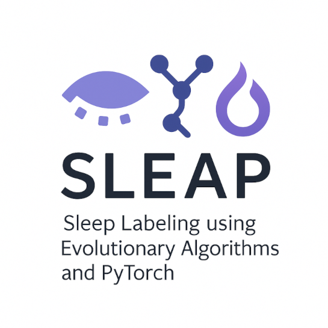

# Signal Fusion NAS Framework

A framework for evolving PyTorch neural networks using the DEAP genetic algorithm library.



Developed at Reykjavik University.

---

## Getting Started

1. **Clone the repo**

   ```bash
   git clone https://github.com/emilhar/signal_fusion_nas.git
   cd signal_fusion_nas
   ```

2. **Create a virtual environment & install dependencies**

   ```bash
   pip install -r requirements.txt
   ```

3. TODO: Instructions on how to 
  * Configure your experiment
  * Run evolution
  * Inspect results

4. TODO: Project structure

## License

This project is licensed under the MIT License.
See [LICENSE](./LICENSE) for details.
